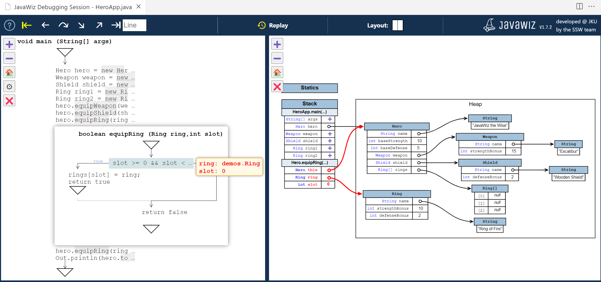
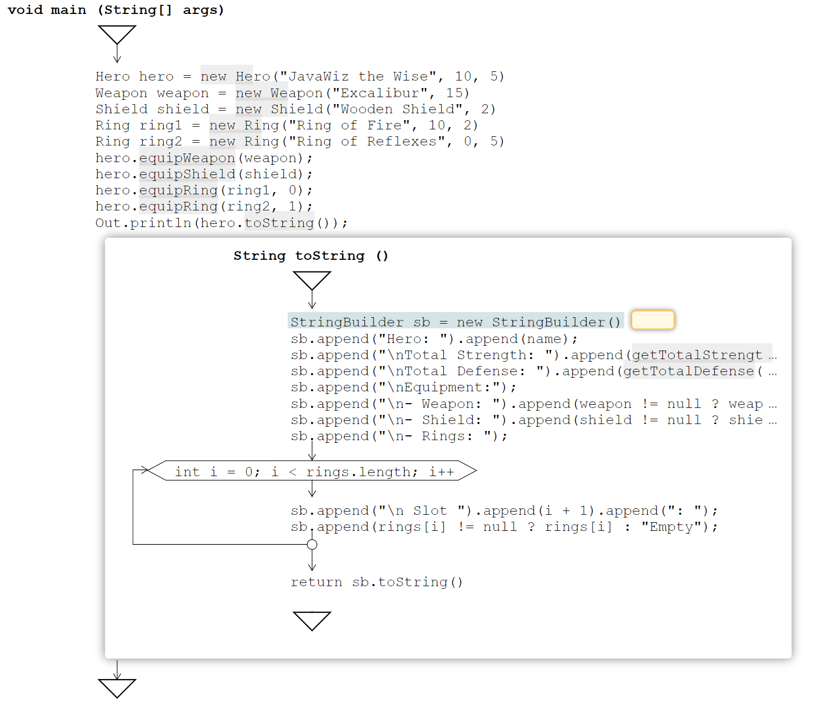
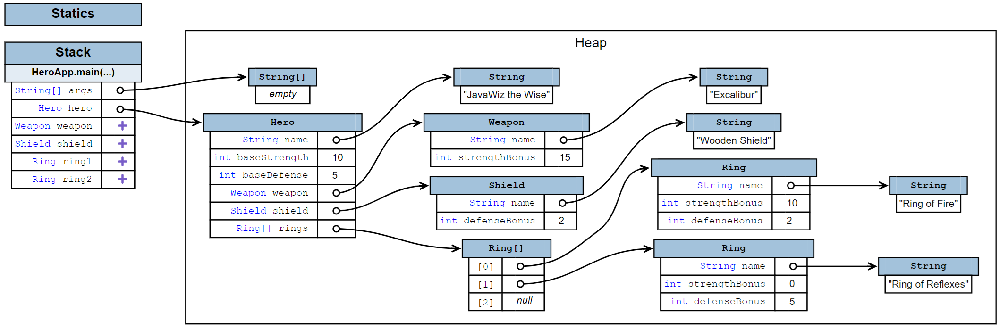
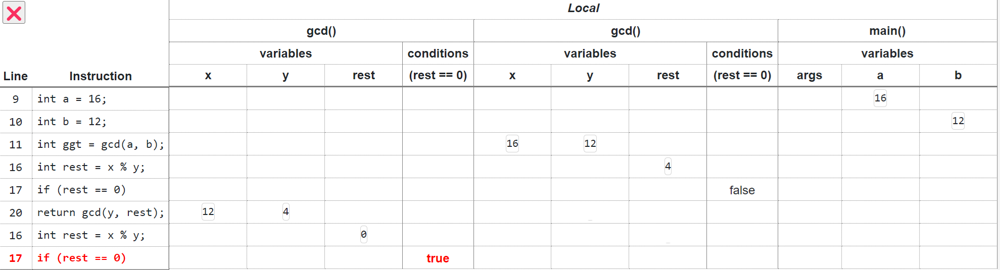
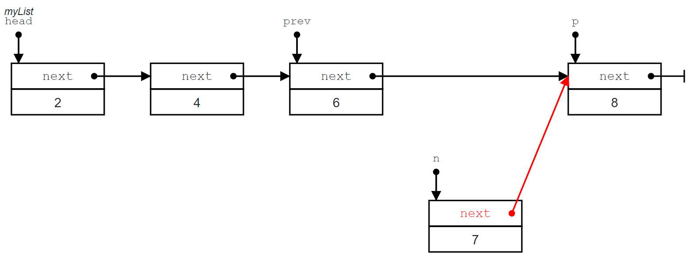
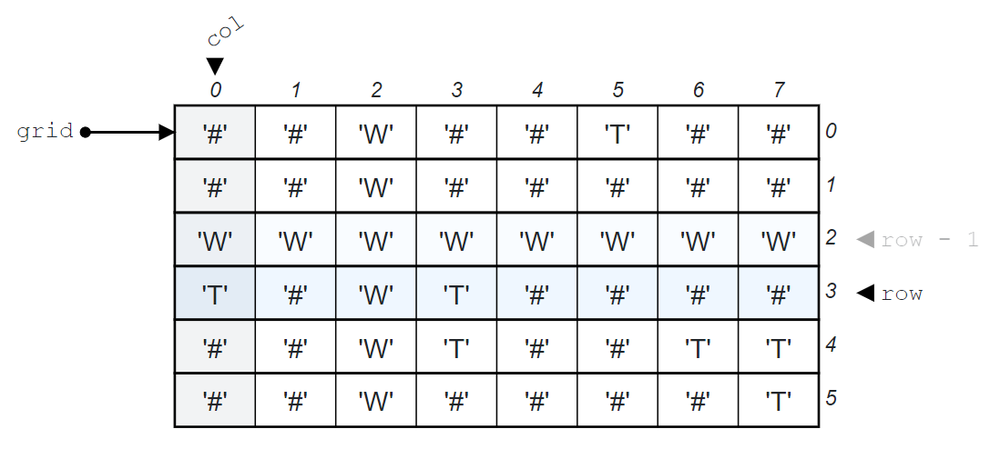
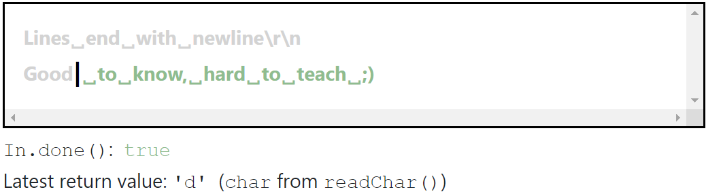

# 🧙 JavaWiz

### An educational visual / graphical debugger for Java

[](https://javawiz.net/)
[](https://marketplace.visualstudio.com/items?itemName=SSW-JKU.javawiz)
[](https://github.com/SSW-JKU/javawiz/releases)
[](https://github.com/SSW-JKU/javawiz/actions/workflows/backend-tests.yml)
[](LICENSE.txt)

[🌐 Visit javawiz.net](https://javawiz.net/) · [📋 View the changelog](https://javawiz.net/changelog.html)

JavaWiz helps programming beginners understand what their Java programs are doing. Step through code line by line and watch control flow, variables, memory, arrays, data structures, method calls, streams, and input evolve in synchronized visualization panels.

Unlike a traditional debugger, JavaWiz records the execution trace. You can move backward and forward through a program without restarting it, making abstract runtime behavior concrete and easier to explain, explore, and revisit.

<p align="center">
  <a href="https://javawiz.net/">
    
  </a>
</p>

## ✨ Why JavaWiz?

- ⏪ **Time-travel debugging** — step backward, replay earlier states, and inspect an execution at your own pace.
- 🧭 **Visual control flow** — follow the currently executing statement in automatically generated flowcharts.
- 🧠 **Concrete memory models** — see stack frames, static variables, heap objects, references, and object relationships.
- 📊 **Execution history** — track variable values and conditions from one statement to the next in a tabular view.
- 🧩 **Data-structure visualizations** — explore arrays, linked lists, and binary trees with purpose-built animated views.
- 🌊 **Java Stream visualization** — understand how values move through Stream API pipelines using marble diagrams.
- 🔗 **Sequence diagrams** — see how objects interact through method calls.
- ⌨️ **Input visualization** — inspect consumed and remaining input when using JavaWiz's `In.java` class.
- 🎓 **Built for teaching and learning** — useful for individual exploration, exercises, and live classroom demonstrations.

## 🔍 Visualization Highlights

| Flowchart View | Memory View |
|:---:|:---:|
| [](https://javawiz.net/#features-section) | [](https://javawiz.net/#features-section) |
| Follow control flow, active statements, values, and method expansion. | Understand stack, statics, heap objects, and references. |

| Tabular View | Lists and Trees |
|:---:|:---:|
| [](https://javawiz.net/#features-section) | [](https://javawiz.net/#features-section) |
| Review execution history, variable changes, and conditions. | Watch traversal, insertion, deletion, and pointer changes. |

| Array View | Input View |
|:---:|:---:|
| [](https://javawiz.net/#features-section) | [](https://javawiz.net/#features-section) |
| See index expressions, assignments, and data movement. | See consumed input, remaining input, and operation results. |

## 🚀 Get JavaWiz

### Visual Studio Code

Install [JavaWiz from the Visual Studio Marketplace](https://marketplace.visualstudio.com/items?itemName=SSW-JKU.javawiz), open a Java file, and use **Debug with JavaWiz** above a `main` method or from the editor context menu.

### IntelliJ IDEA

Download the latest IntelliJ plugin ZIP from [GitHub Releases](https://github.com/SSW-JKU/javawiz/releases). In IntelliJ IDEA, open **Settings → Plugins → ⚙ → Install Plugin from Disk**, then select the downloaded ZIP.

> JavaWiz currently requires **JDK 25 or newer**.

## 📚 Research

JavaWiz was developed at the [Institute for System Software](https://ssw.jku.at/) at Johannes Kepler University Linz, Austria. Its design and educational applications are described in:

> Markus Weninger, Simon Grünbacher, and Herbert Prähofer.<br>
> **JavaWiz: A Trace-Based Graphical Debugger for Software Development Education.**<br>
> 33rd IEEE/ACM International Conference on Program Comprehension (ICPC 2025).

[Read the paper](https://javawiz.net/paper/ICPC_25_Preprint.pdf)

## 🛠️ For Developers

JavaWiz is free and open source. Contributions, bug reports, and feature suggestions are welcome.

### Repository Structure

This project is a Gradle multi-project workspace consisting of five subprojects:

- **backend** — Kotlin/JVM WebSocket server that compiles and step-debugs Java programs using JDK internals
- **frontend** — Vue 3, TypeScript, and Vite visualization UI
- **shared** — TypeScript types shared between `frontend` and `vsc-extension`
- **vsc-extension** — TypeScript VS Code extension that orchestrates the backend and frontend
- **intellij-plugin** — Kotlin IntelliJ IDEA plugin that embeds the same backend and frontend in IDE tool windows

The frontend requires the backend to run to work properly.

### Building

Use the repository's Gradle wrapper from the project root:

```shell
# Build all projects
./gradlew clean build

# Build individual components
./gradlew :frontend:clean :frontend:build
./gradlew :backend:clean :backend:build
./gradlew :intellij-plugin:buildPlugin
```

On Windows, use `gradlew.bat` instead of `./gradlew`.

Build outputs:

- Frontend: `frontend/dist/index.html`
- Backend: `backend/build/libs/backend-<version>.jar`
- IntelliJ plugin: `intellij-plugin/build/distributions/JavaWiz-*.zip`

### Running Locally

```shell
# Start the frontend development server
./gradlew :frontend:run

# Start the backend
./gradlew :backend:run

# Run the IntelliJ plugin in a sandboxed IDE
./gradlew :intellij-plugin:runIde
```

These tasks are also available as IntelliJ run configurations when the repository is imported into IntelliJ IDEA.

### Testing

```shell
# Run all checks
./gradlew check

# Run the backend suite on every configured JDK
./gradlew :backend:testAll
```

Backend tests also run automatically on Windows and Linux for pushed commits, tags, and published GitHub releases.

## Icons

Icons taken from [Flaticon](https://www.flaticon.com/) and others; for detailed attribution, [see the icon sources](https://github.com/SSW-JKU/javawiz/blob/main/frontend/src/assets/sources.txt).
