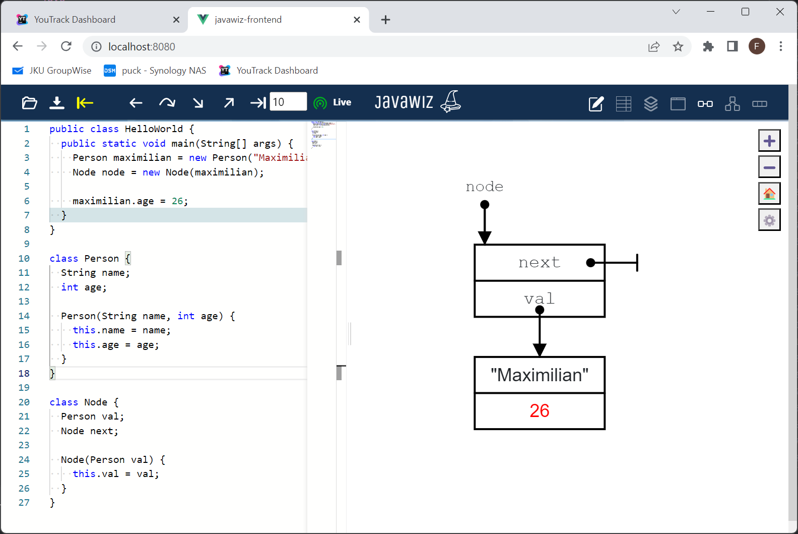

# Code
```java
public class ChangesInReferenceNode {
  public static void main(String[] args) {
    Person maximilian = new Person("Maximilian", 25);
    Node node = new Node(maximilian);

    maximilian.age = 26;
  }
}

class Person {
  String name;
  int age;

  Person(String name, int age) {
    this.name = name;
    this.age = age;
  }
}

class Node {
  Person val;
  Node next;

  Node(Person val) {
    this.val = val;
  }
}
```

# End Result
