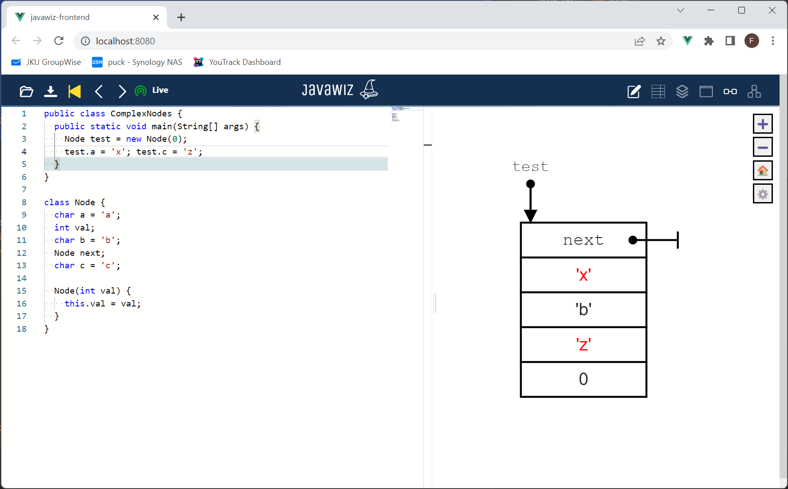

# Code
## Test 1
```java
public class ComplexNodes {
  public static void main(String[] args) {
    Node test = new Node(0);
    test.a = 'x'; test.c = 'z';
  }
}

class Node {
  char a = 'a';
  int val;
  char b = 'b';
  Node next;
  char c = 'c';
  
  Node(int val) {
    this.val = val;
  }
}
```

## Test 2
```java
public class ComplexNodes {
  public static void main(String[] args) {
    Node test = new Node(0);
    test.a = 'x'; test.c = 'z';
  }
}

class Node {
  char a = 'a';
  Node next;
  char b = 'b';
  int val;
  char c = 'c';

  Node(int val) {
    this.val = val;
  }
}
```

# End Result


# Remarks
 - Both tests should have the same output in list visualization.