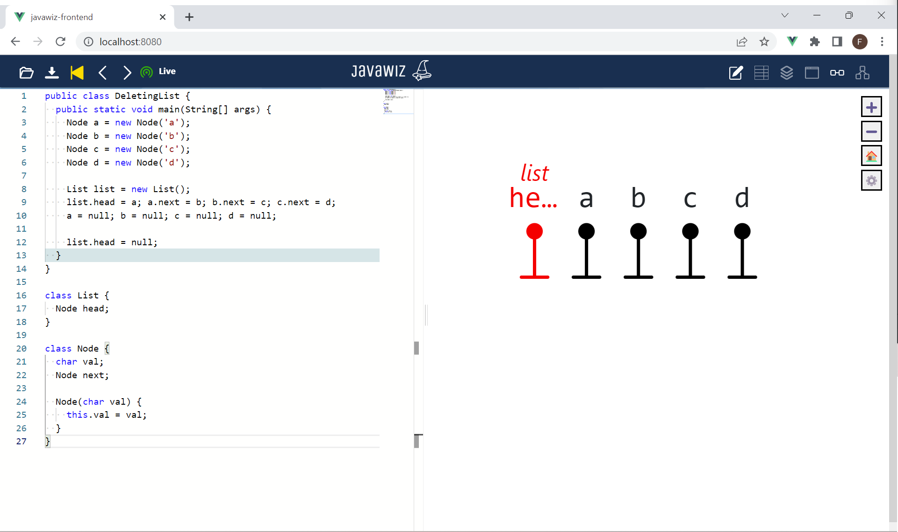

# Code
```java
public class DeletingList {
  public static void main(String[] args) {
    Node a = new Node('a');
    Node b = new Node('b');
    Node c = new Node('c');
    Node d = new Node('d');

    List list = new List();
    list.head = a; a.next = b; b.next = c; c.next = d;
    a = null; b = null; c = null; d = null;

    list.head = null;
  }
}

class List {
  Node head;
}

class Node {
  char val;
  Node next;

  Node(char val) {
    this.val = val;
  }
}
```

# End Result


# Remarks
- In the last step the pointers c and d have to move from the end of the list to the front
- Pointer `head` may be cut off, yet tooltip should show which pointer it is