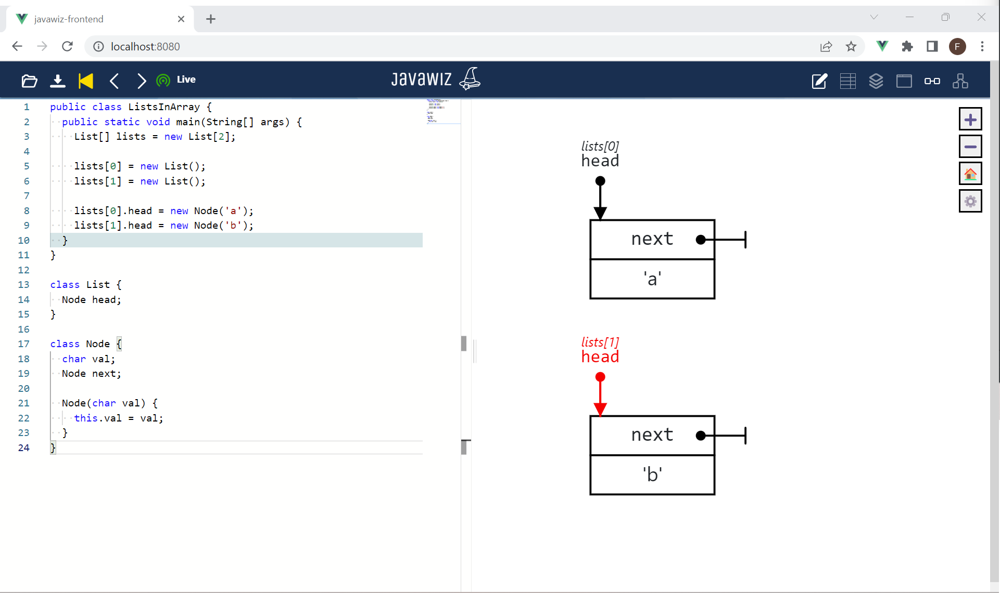

# Code
```java
public class ListsInArray {
  public static void main(String[] args) {
    List[] lists = new List[2];

    lists[0] = new List();
    lists[1] = new List();

    lists[0].head = new Node('a');
    lists[1].head = new Node('b');
  }
}

class List {
  Node head;
}

class Node {
  char val;
  Node next;

  Node(char val) {
    this.val = val;
  }
}
```

# End Result
