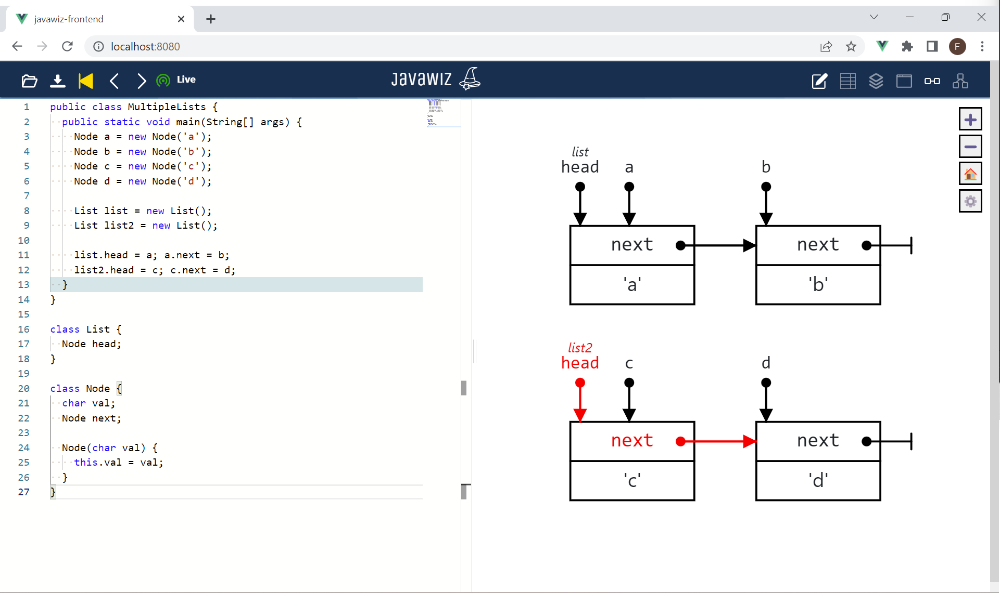

# Code
```java
public class MultipleLists {
  public static void main(String[] args) {
    Node a = new Node('a');
    Node b = new Node('b');
    Node c = new Node('c');
    Node d = new Node('d');

    List list = new List();
    List list2 = new List();

    list.head = a; a.next = b;
    list2.head = c; c.next = d;
  }
}

class List {
  Node head;
}

class Node {
  char val;
  Node next;

  Node(char val) {
    this.val = val;
  }
}
```

# End Result


# Remarks
- Animation of last step is important (D3 has to distinguish the pointers with the same name correctly)
- The variables head can be distinguished with the tooltip ("head of l1" and "head of l2")