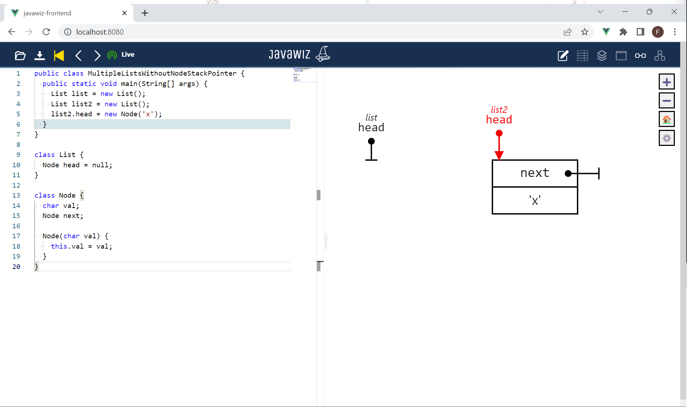

# Code
```java
public class MultipleListsWithoutNodeStackPointer {
  public static void main(String[] args) {
    List list = new List();
    List list2 = new List();
    list2.head = new Node('x');
  }
}

class List {
  Node head = null;
}

class Node {
  char val;
  Node next;

  Node(char val) {
    this.val = val;
  }
}
```

# End Result
