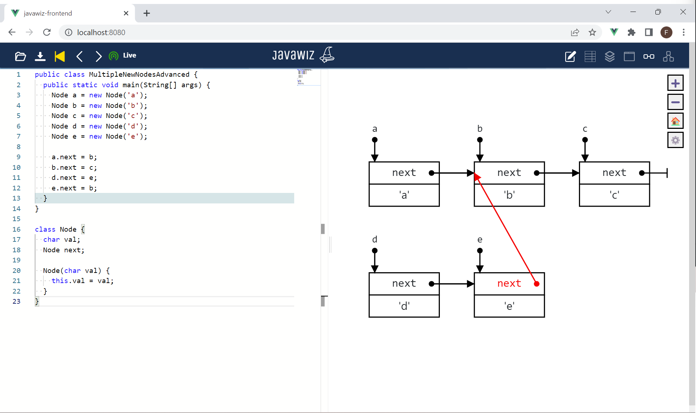

# Code
```java
public class MultipleNewNodesAdvanced {
  public static void main(String[] args) {
    Node a = new Node('a');
    Node b = new Node('b');
    Node c = new Node('c');
    Node d = new Node('d');
    Node e = new Node('e');

    a.next = b;
    b.next = c;
    d.next = e;
    e.next = b;
  }
}

class Node {
  char val;
  Node next;

  Node(char val) {
    this.val = val;
  }
}
```

# End Result


# Remarks
- When nodes are pointing to a node on another level no space is kept free (in contrast to when they are pointing to a node in a list, see test 
  [MultipleNewNodesConnectedToList](../MultipleNewNodesConnectedToList/MultipleNewNodesConnectedToList.md))