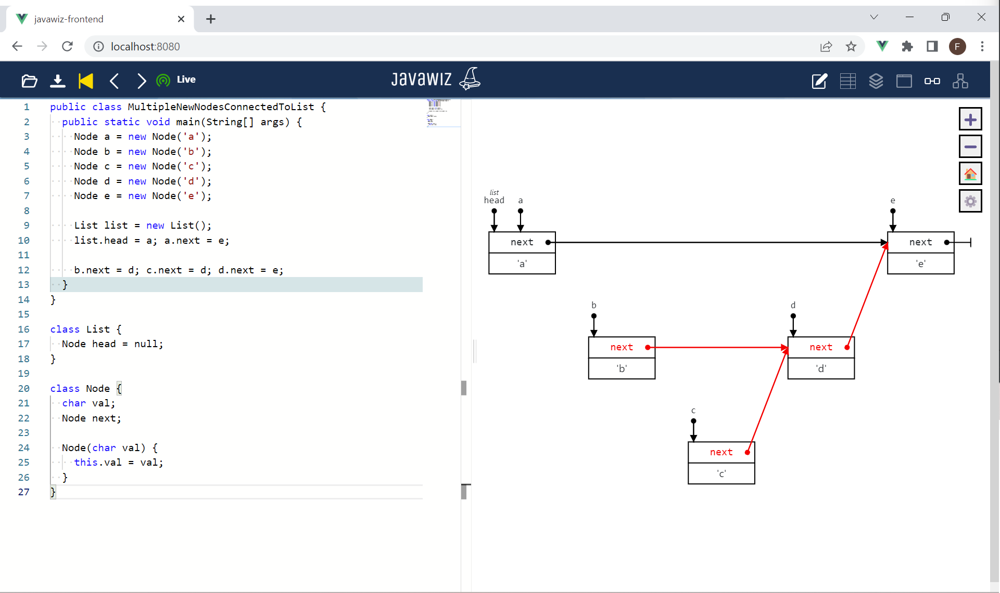

# Code
```java
public class MultipleNewNodesConnectedToList {
  public static void main(String[] args) {
    Node a = new Node('a');
    Node b = new Node('b');
    Node c = new Node('c');
    Node d = new Node('d');
    Node e = new Node('e');

    List list = new List();
    list.head = a; a.next = e;

    b.next = d; c.next = d; d.next = e;
  }
}

class List {
  Node head = null;
}

class Node {
  char val;
  Node next;

  Node(char val) {
    this.val = val;
  }
}
```

# End Result


# Remarks
- When a node that is not in a list is pointing to some node in a list, space for it and its parents is kept free (in contrast to when they are not pointing to a node in the 
  list, see test
  [MultipleNewNodesAdvanced](../MultipleNewNodesAdvanced/MultipleNewNodesAdvanced.md))
