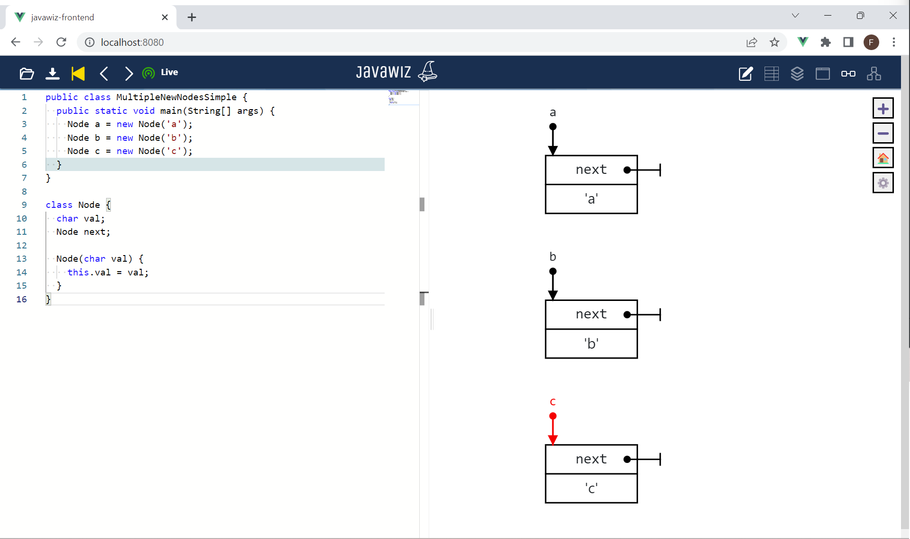

# Code
```java
public class MultipleNewNodesSimple {
  public static void main(String[] args) {
    Node a = new Node('a');
    Node b = new Node('b');
    Node c = new Node('c');
  }
}

class Node {
  char val;
  Node next;

  Node(char val) {
    this.val = val;
  }
}
```

# End Result

