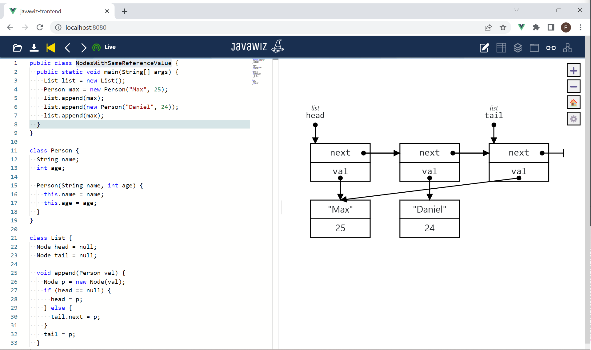

# Code
```java
public class NodesWithSameReferenceValue {
  public static void main(String[] args) {
    List list = new List();
    Person max = new Person("Max", 25);
    list.append(max);
    list.append(new Person("Daniel", 24));
    list.append(max);
  }
}

class Person {
  String name;
  int age;

  Person(String name, int age) {
    this.name = name;
    this.age = age;
  }
}

class List {
  Node head = null;
  Node tail = null;

  void append(Person val) {
    Node p = new Node(val);
    if (head == null) {
      head = p;
    } else {
      tail.next = p;
    }
    tail = p;
  }
}

class Node {
  Person val;
  Node next;

  Node(Person val) {
    this.val = val;
  }
}
```

# End Result
