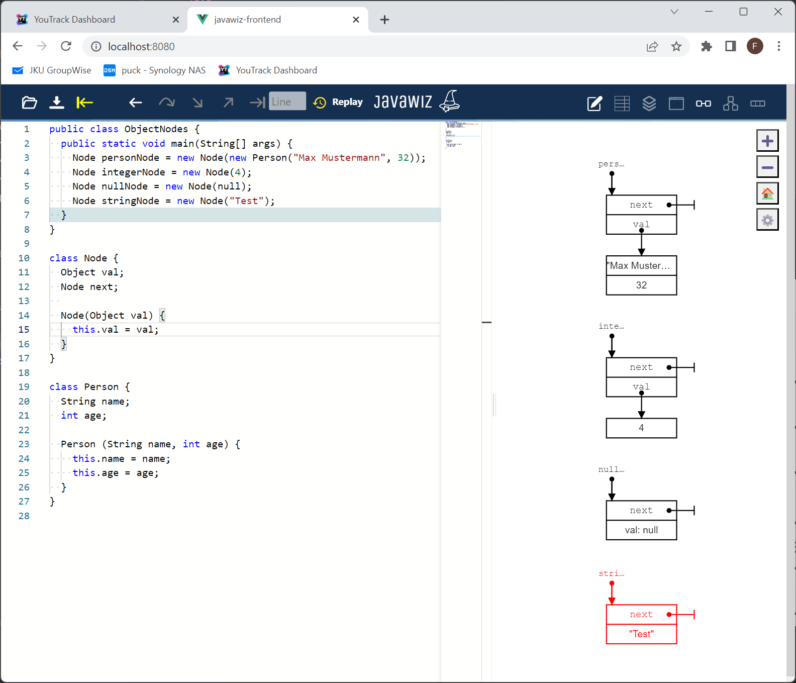

# Code
```java
public class ObjectNodes {
  public static void main(String[] args) {
    Node personNode = new Node(new Person("Max Mustermann", 32));
    Node integerNode = new Node(4);
    Node nullNode = new Node(null);
    Node stringNode = new Node("Test");
  }
}

class Node {
  Object val;
  Node next;

  Node(Object val) {
    this.val = val;
  }
}

class Person {
  String name;
  int age;

  Person (String name, int age) {
    this.name = name;
    this.age = age;
  }
}
```

# End Result
