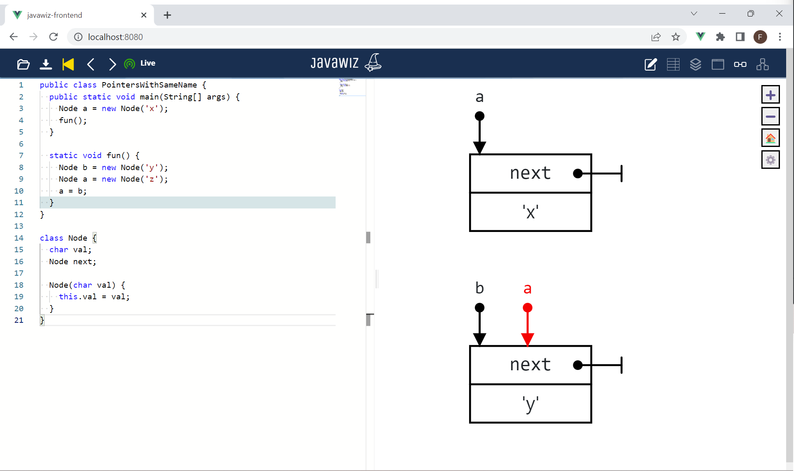

# Code
```java
public class PointersWithSameName {
  public static void main(String[] args) {
    Node a = new Node('x');
    fun();
  }

  static void fun() {
    Node b = new Node('y');
    Node a = new Node('z');
    a = b;
  }
}

class Node {
  char val;
  Node next;

  Node(char val) {
    this.val = val;
  }
}
```

# End Result


# Remarks
- Animation of last step in `fun()` is important (D3 has to distinguish the pointers with the same name correctly)