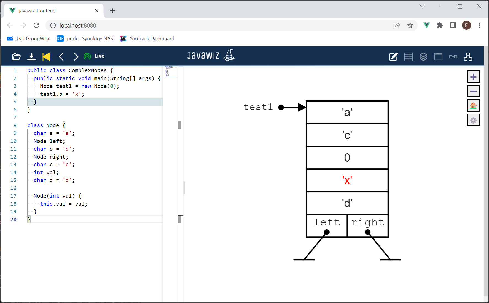

# Code
```java
public class ComplexNodes {
  public static void main(String[] args) {
    Node test1 = new Node(0);
    test1.b = 'x';
  }
}

class Node {
  char a = 'a';
  Node left;
  char b = 'b';
  Node right;
  char c = 'c';
  int val;
  char d = 'd';

  Node(int val) {
    this.val = val;
  }
}
```

# End Result

