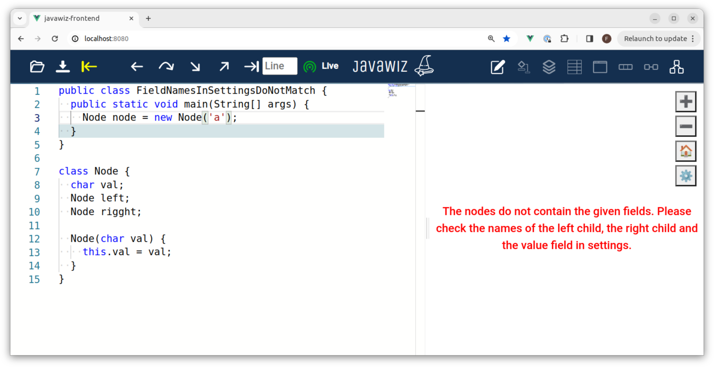

# Code
## Test 1
```java
public class FieldNamesInSettingsDoNotMatch {
  public static void main(String[] args) {
    Node node = new Node('a');
  }
}

class Node {
  char val;
  Node left;
  Node rigght;

  Node(char val) {
    this.val = val;
  }
}
```

## Test 2
```java
public class FieldNamesInSettingsDoNotMatch {
  public static void main(String[] args) {
    Node node = new Node();
  }
}

class Node {
}
```

# End Result
