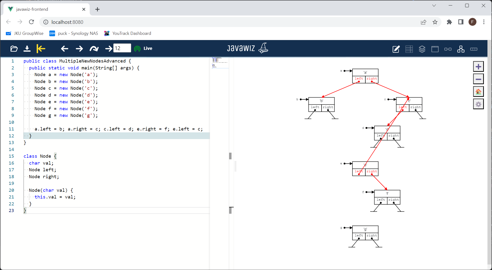

# Code
```java
public class MultipleNewNodesAdvanced {
  public static void main(String[] args) {
    Node a = new Node('a');
    Node b = new Node('b');
    Node c = new Node('c');
    Node d = new Node('d');
    Node e = new Node('e');
    Node f = new Node('f');
    Node g = new Node('g');

    a.left = b; a.right = c; c.left = d; e.right = f; e.left = c;
  }
}

class Node {
  char val;
  Node left;
  Node right;

  Node(char val) {
    this.val = val;
  }
}
```

# End Result
