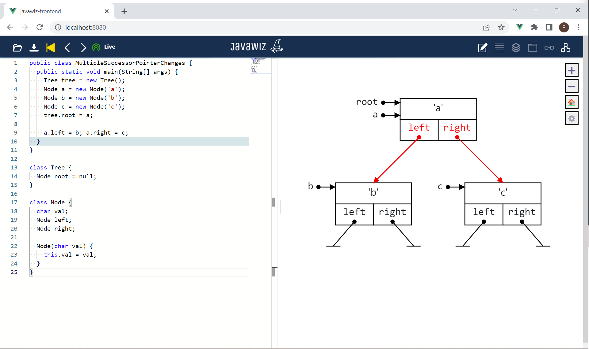

# Code
```java
public class MultipleSuccessorPointerChanges {
  public static void main(String[] args) {
    Tree tree = new Tree();
    Node a = new Node('a');
    Node b = new Node('b');
    Node c = new Node('c');
    tree.root = a;

    a.left = b; a.right = c;
  }
}

class Tree {
  Node root = null;
}

class Node {
  char val;
  Node left;
  Node right;

  Node(char val) {
    this.val = val;
  }
}
```

# End Result
