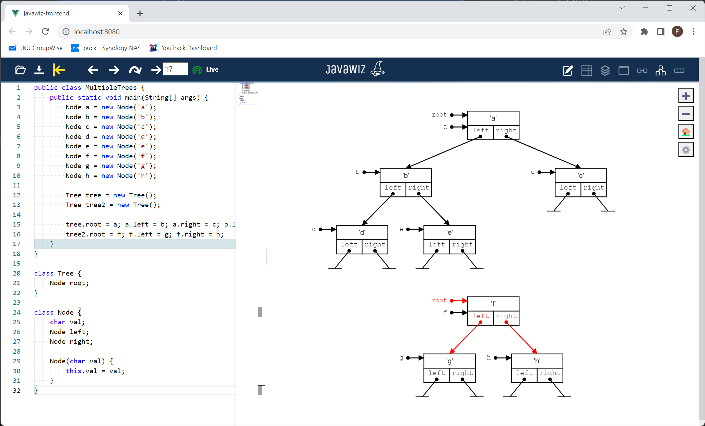

# Code

```java
public class MultipleTrees {
  public static void main(String[] args) {
    Node a = new Node('a');
    Node b = new Node('b');
    Node c = new Node('c');
    Node d = new Node('d');
    Node e = new Node('e');
    Node f = new Node('f');
    Node g = new Node('g');
    Node h = new Node('h');

    Tree tree = new Tree();
    Tree tree2 = new Tree();

    tree.root = a;
    a.left = b;
    a.right = c;
    b.left = d;
    b.right = e;
    tree2.root = f;
    f.left = g;
    f.right = h;
  }
}

class Tree {
  Node root;
}

class Node {
  char val;
  Node left;
  Node right;

  Node(char val) {
    this.val = val;
  }
}
```

# End Result


