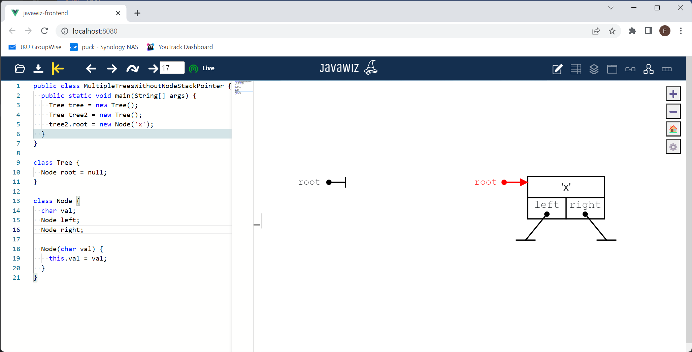

# Code
```java
public class MultipleTreesWithoutNodeStackPointer {
  public static void main(String[] args) {
    Tree tree = new Tree();
    Tree tree2 = new Tree();
    tree2.root = new Node('x');
  }
}

class Tree {
  Node root = null;
}

class Node {
  char val;
  Node left;
  Node right;

  Node(char val) {
    this.val = val;
  }
}
```

# End Result

