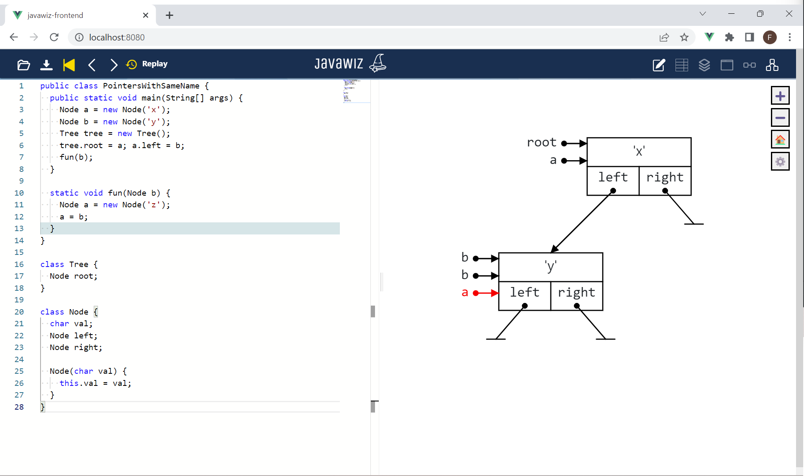

# Code
```java
public class PointersWithSameName {
  public static void main(String[] args) {
    Node a = new Node('x');
    Node b = new Node('y');
    Tree tree = new Tree();
    tree.root = a; a.left = b;
    fun(b);
  }

  static void fun(Node b) {
    Node a = new Node('z');
    a = b;
  }
}

class Tree {
  Node root;
}

class Node {
  char val;
  Node left;
  Node right;

  Node(char val) {
    this.val = val;
  }
}
```

# End Result


# Remarks
- Animation of last step in `fun()` is important (D3 has to distinguish the pointers with the same name correctly)