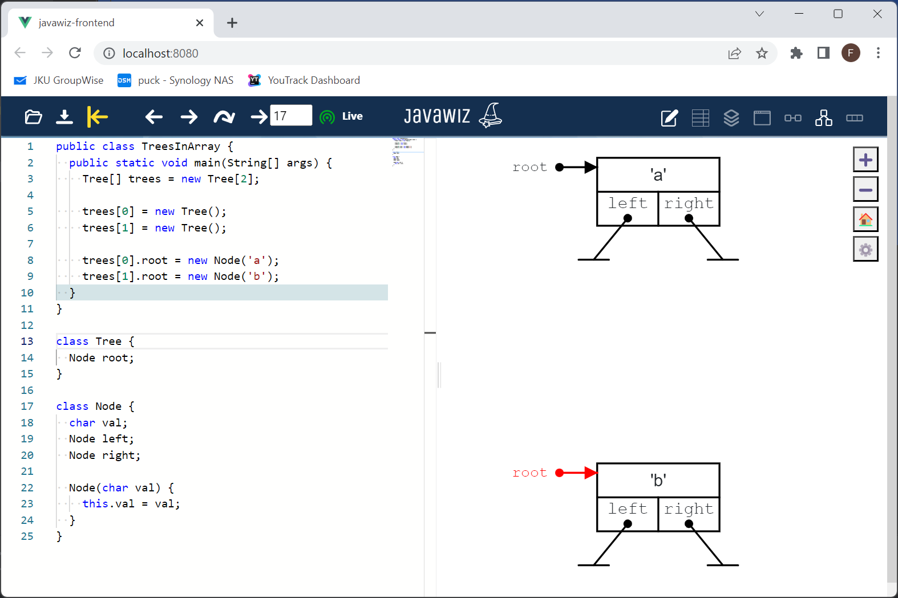

# Code
```java
public class TreesInArray {
  public static void main(String[] args) {
    Tree[] trees = new Tree[2];

    trees[0] = new Tree();
    trees[1] = new Tree();

    trees[0].root = new Node('a');
    trees[1].root = new Node('b');
  }
}

class Tree {
  Node root;
}

class Node {
  char val;
  Node left;
  Node right;

  Node(char val) {
    this.val = val;
  }
}
```

# End Result

