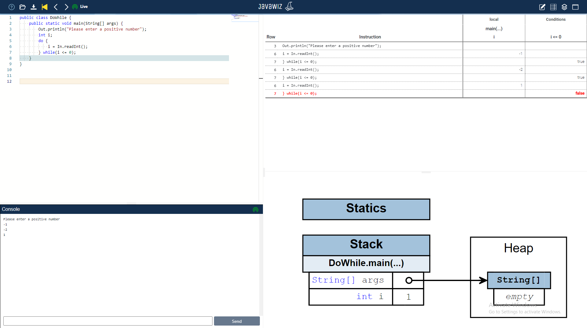

# Code


```java
public class DoWhile {
    public static void main(String[] args) {
        Out.println("Please enter a positive number");
        int i;
        do {
            i = In.readInt();
        } while(i <= 0);
    }
}
```


# End Result


# Remarks
code is not an automated test case because input is required