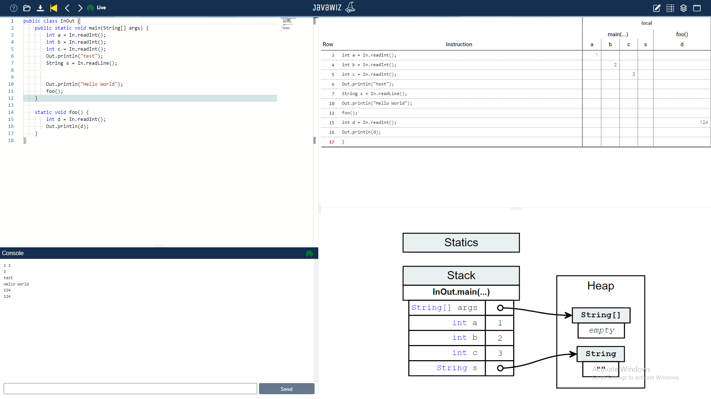

# Code
```java
public class InOut {
    public static void main(String[] args) {
        int a = In.readInt();
        int b = In.readInt();
        int c = In.readInt();
        Out.println("test");
        String s = In.readLine();
        
        
        Out.println("Hello World");
        foo();
    }
        
    static void foo() {
        int d = In.readInt();
        Out.println(d);
    }
}
```


# End Result
