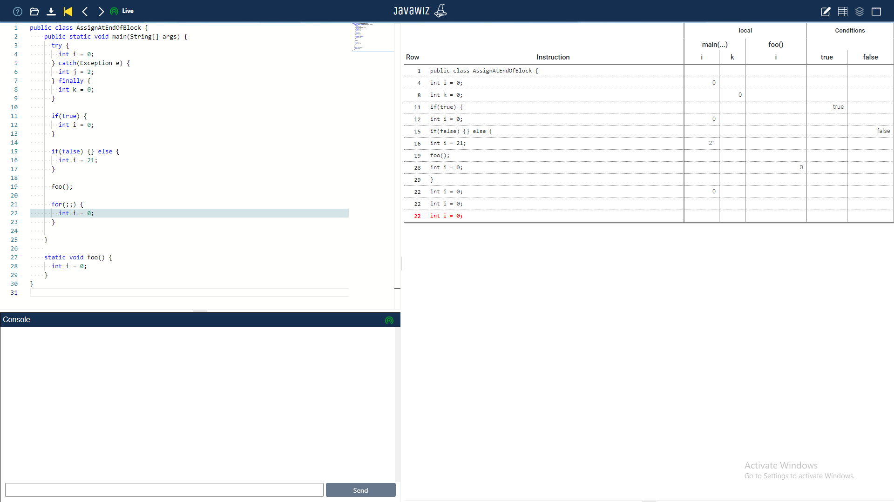

# Code
```java
public class AssignAtEndOfBlock {
    public static void main(String[] args) {
      try {
        int i = 0;
      } catch(Exception e) {
        int j = 2;
      } finally {
        int k = 0;
      }
    
      if(true) {
        int i = 0;
      }
    
      if(false) {} else {
        int i = 21;
      }
    
      foo();
    
      for(;;) {
        int i = 0;
      }
    
    }
    
    static void foo() {
      int i = 0;
    }
}
```

# End Result


# Remarks
* this test does not cover catch blocks because exceptions slow down the desk test significantly
* this test is not relevant anymore because we stopped logging assignments at the end of blocks