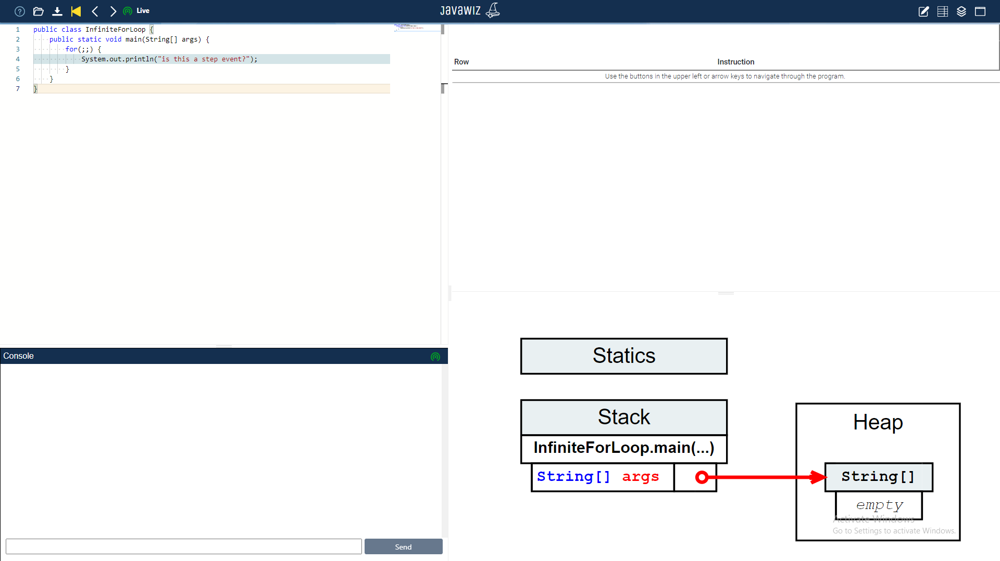

# Code
```java
public class InfiniteForLoop {
    public static void main(String[] args) {
        for(;;) {
            System.out.println("is this a step event?");
        }
    }
}
```

# End Result


# Remarks
this works the way it should at the time of writing. 
for-loops with the statement in the same line as the head do not work yet.