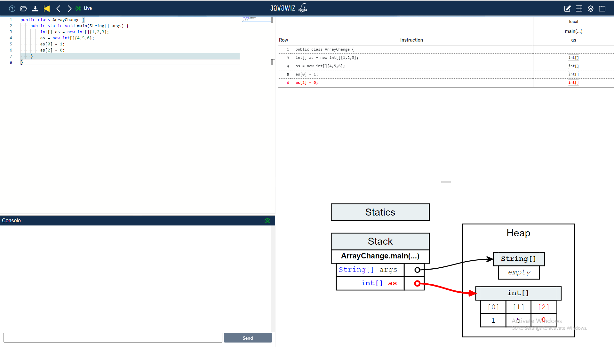

# Code
```java
public class ArrayChange {
    public static void main(String[] args) {
        int[] as = new int[]{1,2,3};
        as = new int[]{4,5,6};
        as[0] = 1;
        as[2] = 0;
    }
}
```

# End Result
