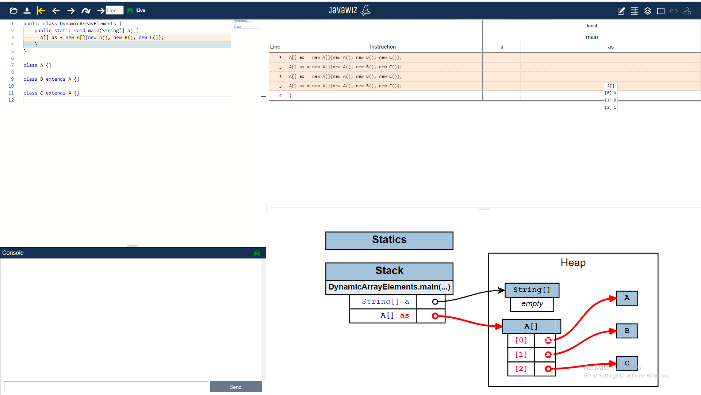

# Code
```java
public class DynamicArrayElements {
    public static void main(String[] a) {
      A[] as = new A[]{new A(), new B(), new C()};
    }
}

class A {}

class B extends A {}

class C extends A {}
```

# End Result
