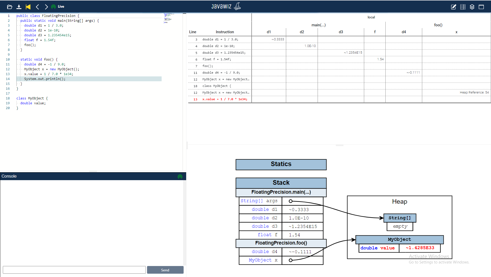

# Code
```java
public class FloatingPrecision {
  public static void main(String[] args) {
    double d1 = 1 / 3.0;
    double d2 = 1e-10;
    double d3 = 1.235454e15;
    float f = 1.54f;
    foo();
  }

  static void foo() {
    double d4 = -1 / 9.0;
    MyObject x = new MyObject();
    x.value = 1 / 7.0 * 1e34;
    System.out.println();
  }
}

class MyObject {
  double value;
}
```

# End Result
