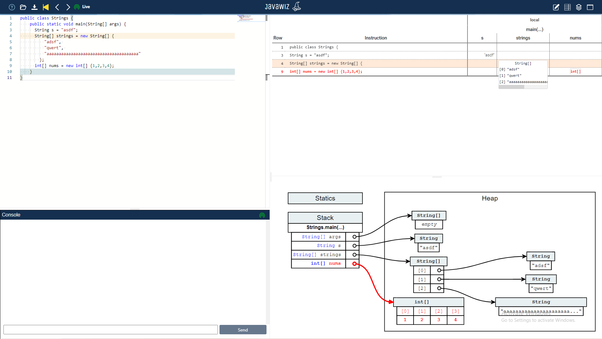

# Code
```java
public class Strings {
    public static void main(String[] args) {
      String s = "asdf";
      String[] strings = new String[] {
          "adsf", 
          "qwert", 
          "aaaaaaaaaaaaaaaaaaaaaaaaaaaaaaaaaaaaaa"
        };
      int[] nums = new int[] {1,2,3,4};
    }
}
```


# End Result

# Remarks
* arrays should only expand on hover