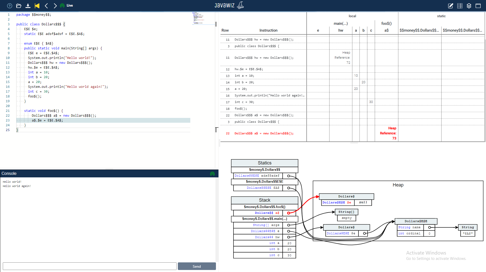

# Code
```java
package $$money$$;

public class Dollars$$$ {
    E$E $e;
    static E$E adsf$adsf = E$E.$A$;
  
    enum E$E { $A$}
    public static void main(String[] args) {
      E$E e = E$E.$A$;
      System.out.println("Hello world!");
      Dollars$$$ hw = new Dollars$$$();
      hw.$e = E$E.$A$;
      int a = 10;
      int b = 20;
      a = 20;
      System.out.println("Hello world again!");
      int c = 30;
      foo$();
    }
  
    static void foo$() {
        Dollars$$$ a$ = new Dollars$$$();
        a$.$e = E$E.$A$;
    }
}
```

# End Result


# Remarks
* for some reason, only two dollar signs are displayed in the heap