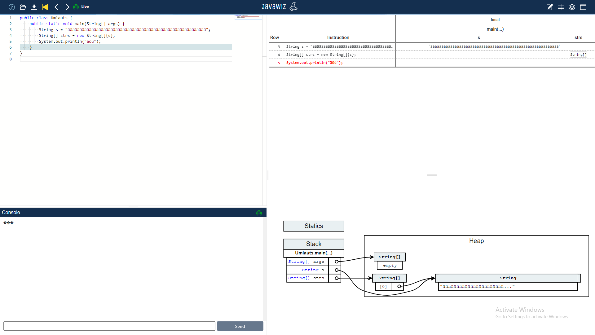

# Code
```java
public class Umlauts {
    public static void main(String[] args) {
        String s = "ääääääääääääääääääääääääääääääääääääääääääääääääääääääääää";
        String[] strs = new String[]{s};
        System.out.println("äöü");
    }
}

```

# End Result


# Remarks
* console output does not work yet
* spacing is incorrect in heap