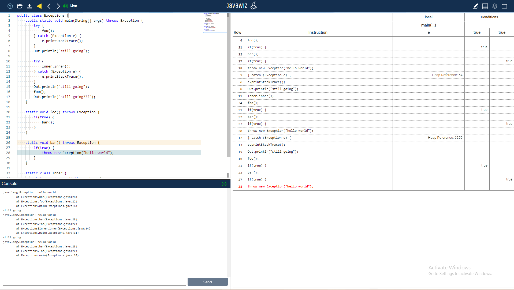

# End Result

## Console Output:
  

    java.lang.Exception: hello world
        at Exceptions.bar(Exceptions.java:28)
        at Exceptions.foo(Exceptions.java:22)
        at Exceptions.main(Exceptions.java:4)
    still going
    java.lang.Exception: hello world
        at Exceptions.bar(Exceptions.java:28)
        at Exceptions.foo(Exceptions.java:22)
        at Exceptions$Inner.inner(Exceptions.java:34)
        at Exceptions.main(Exceptions.java:11)
    still going
    java.lang.Exception: hello world
        at Exceptions.bar(Exceptions.java:28)
        at Exceptions.foo(Exceptions.java:22)
        at Exceptions.main(Exceptions.java:16)