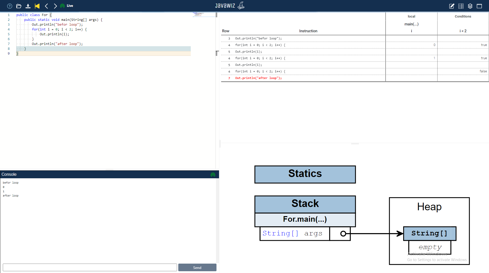

# End Result

# Remarks
for some reason, the debugger does not start at the head of the main class, which it does in all other test cases

in the current version, the head of the for-loop generates one line in the desk test rather than two.