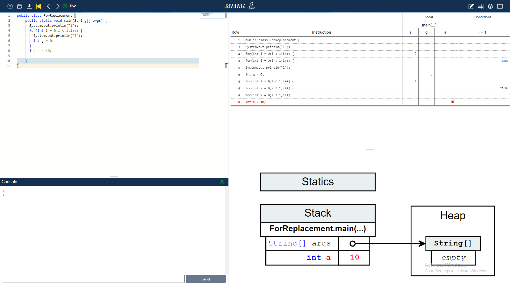

# End Result

# Remarks
* this caused a bug in the ForVisitor at some point
* the head of the for loop now only takes one step to go through. the last change to i is not detected because i goes out of scope upon loop exit.