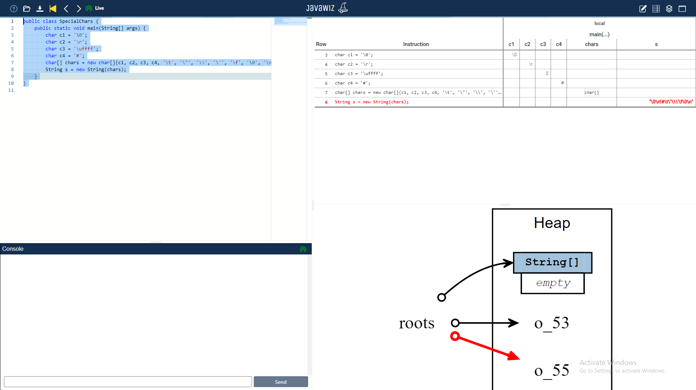

# End Result

# Remarks
* in the current version, the heap has problems displaying the string
* currently this test case pretty much only checks whether the file compiles, which used to be a problem